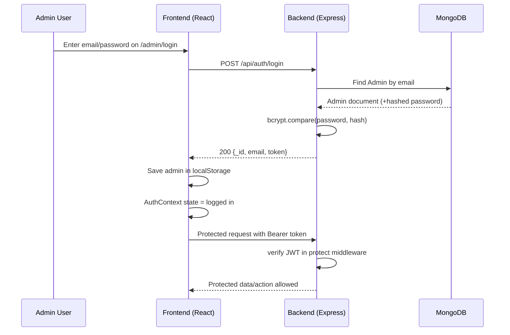

# AlbumHub Architecture Guide

This document explains the full architecture and low-level behavior of the current AlbumHub codebase.

## 1) Technology Stack

### Frontend

- React 18
- Vite 5
- React Router DOM 6
- Axios
- Tailwind CSS
- react-hot-toast

### Backend

- Node.js + Express 4
- MongoDB + Mongoose 8
- JWT (jsonwebtoken)
- bcryptjs
- Multer + multer-storage-cloudinary
- Cloudinary (optional, controlled by env)

### Infrastructure / Runtime

- Environment-based config via `.env`
- Static file serving from `/uploads`
- CORS enabled for API consumption from frontend

## 2) Repository Structure

- `frontend/src/main.jsx`: React entry point
- `frontend/src/App.jsx`: route composition + global providers
- `frontend/src/api/axios.js`: API client + auth header interceptor
- `frontend/src/context/AuthContext.jsx`: auth state lifecycle
- `frontend/src/components/*`: reusable UI and route protection
- `frontend/src/pages/*`: public page-level modules
- `frontend/src/pages/admin/*`: admin page-level modules

- `backend/src/server.js`: Express bootstrap and route mounting
- `backend/src/config/db.js`: MongoDB connection
- `backend/src/config/cloudinary.js`: Cloudinary init
- `backend/src/models/*.js`: MongoDB schema models
- `backend/src/routes/*.js`: route definitions
- `backend/src/controllers/*.js`: request handlers / business logic
- `backend/src/middleware/*.js`: auth, upload, error handling
- `backend/src/utils/generateToken.js`: JWT helper
- `backend/seedAdmin.js`: seed default admin account

## 3) Frontend Module-by-Module

### Core App Shell

#### `frontend/src/main.jsx`

- Mounts `<App />` into `#root`.
- Runs under `React.StrictMode` in development.

#### `frontend/src/App.jsx`

- Wraps app with `AuthProvider`.
- Initializes `BrowserRouter` and global `<Toaster />`.
- Renders shared `<Navbar />` and `<Footer />`.
- Defines routes:
  - Public: `/`, `/albums`, `/albums/:id`, `/about`, `/contact`
  - Auth page: `/admin/login`
  - Protected pages: `/admin/dashboard`, `/admin/albums`, `/admin/albums/add`

### State + Networking

#### `frontend/src/context/AuthContext.jsx`

- Keeps `admin` state in React context.
- Boots from `localStorage` key `admin`.
- Decodes JWT on initial mount and logs out if expired.
- Exposes:
  - `admin`
  - `login(data)`
  - `logout()`

#### `frontend/src/api/axios.js`

- Axios instance uses `baseURL = import.meta.env.VITE_API_URL`.
- Request interceptor auto-attaches `Authorization: Bearer <token>` when `admin` exists in localStorage.

#### `frontend/src/components/ProtectedRoute.jsx`

- Guards admin pages in the UI layer.
- Redirects to `/admin/login` when `admin` context is missing.

### Shared UI Components

#### `frontend/src/components/Navbar.jsx`

- Top navigation for public pages.
- Hidden on admin routes and Contact page (Contact has custom nav).

#### `frontend/src/components/Footer.jsx`

- Shared site footer and static links.

#### `frontend/src/components/AlbumCard.jsx`

- Card UI for album listing.
- Links to `/albums/:id`.

#### `frontend/src/components/AdminSidebar.jsx`

- Admin navigation links.
- Logout clears auth context and routes back to login.

#### `frontend/src/components/Loader.jsx`

- Loading spinner component.

#### `frontend/src/components/ErrorMessage.jsx`

- Standard inline error UI.

#### `frontend/src/components/Toast.jsx`

- File exists but currently empty (not used).

### Public Pages

#### `frontend/src/pages/Home.jsx`

- Marketing-style landing page.
- Contains custom visual sections and static feature data.

#### `frontend/src/pages/About.jsx`

- Story, team, and values page.

#### `frontend/src/pages/Contact.jsx`

- Styled contact page with local form state.
- Current submit behavior is UI-only (no backend message endpoint currently connected).

#### `frontend/src/pages/Albums.jsx`

- Fetches all albums from `GET /albums`.
- Renders list via `AlbumCard`.
- Handles loading and error states.

#### `frontend/src/pages/AlbumDetails.jsx`

- Reads `id` from URL params.
- Calls `GET /albums/:id`.
- Shows album metadata, photos array, or fallback cover image.

### Admin Pages

#### `frontend/src/pages/admin/AdminLogin.jsx`

- Periodically checks backend health via `/health`.
- Sends login credentials to `/auth/login`.
- Stores auth data via `AuthContext.login()`.
- Navigates to `/admin/dashboard` on success.

#### `frontend/src/pages/admin/Dashboard.jsx`

- Pulls all albums and calculates simple counters (total albums/categories).

#### `frontend/src/pages/admin/AlbumsTable.jsx`

- Lists albums in table.
- Supports delete (`DELETE /albums/:id`).
- Has link to add album page.

#### `frontend/src/pages/admin/AddAlbum.jsx`

- Uses multipart upload to create album.
- Single file maps to `coverImage`.
- Multiple files map to `coverImages` and become `photos[]`.

#### `frontend/src/pages/admin/EditAlbum.jsx`

- Loads album and updates metadata via `PUT /albums/:id`.
- Displays existing photos.

## 4) Backend Module-by-Module

### Bootstrap

#### `backend/src/server.js`

- Loads env and connects DB.
- Enables CORS + JSON parsing.
- Serves local uploads from `/uploads`.
- Health route: `GET /api/health`.
- Mounts route groups:
  - `/api/auth`
  - `/api/albums`
- Applies not-found and centralized error middleware.

### Config

#### `backend/src/config/db.js`

- Connects Mongoose with timeout.
- Fails fast if DB connection fails.

#### `backend/src/config/cloudinary.js`

- Configures Cloudinary from env variables.

### Models

#### `backend/src/models/Admin.js`

- Admin schema: email, password, role.
- `pre('save')` hook hashes password with bcrypt.
- `matchPassword(plain)` compares plain password to hash.

#### `backend/src/models/Album.js`

- Album schema fields:
  - `title` (required)
  - `artist` (required)
  - `description`, `category`, `tracks[]`
  - `coverImage`, `photos[]`, `releaseDate`
- Adds timestamps.

### Middleware

#### `backend/src/middleware/authMiddleware.js`

- Parses bearer token from `Authorization` header.
- Verifies JWT using `JWT_SECRET`.
- Loads admin document into `req.admin`.
- Rejects with 401 when missing/invalid token.

#### `backend/src/middleware/uploadMiddleware.js`

- Storage strategy:
  - Cloudinary if credentials exist.
  - Local disk `uploads/` if not.
- Validates MIME type (`jpg`, `jpeg`, `png`, `webp`).
- Upload limit currently allows up to 500 files.

#### `backend/src/middleware/errorMiddleware.js`

- `notFound` builds 404 error for unmatched routes.
- `errorHandler` returns JSON error payload with `message` and `path`.

### Routes + Controllers

#### `backend/src/routes/authRoutes.js`

- `POST /login` -> `loginAdmin`

#### `backend/src/controllers/authController.js`

- Finds admin by email.
- Validates password hash.
- Returns signed JWT + admin identity.

#### `backend/src/routes/albumRoutes.js`

- `GET /` public
- `GET /:id` public
- `POST /` protected + multipart upload
- `PUT /:id` protected + optional single file upload
- `DELETE /:id` protected

#### `backend/src/controllers/albumController.js`

- `getAlbums`: returns all albums.
- `getAlbumById`: returns one album or 404.
- `createAlbum`:
  - Handles both single and bulk upload input.
  - For multiple files, stores all photo URLs in `photos` and first photo as `coverImage`.
- `updateAlbum`: merges body fields and optional uploaded cover image.
- `deleteAlbum`: deletes album document.

### Utility

#### `backend/src/utils/generateToken.js`

- Signs token payload `{ id }` with configurable expiry.

### Seed

#### `backend/seedAdmin.js`

- Deletes all admin records.
- Creates default admin:
  - email: `admin@example.com`
  - password: `Admin@123`

## 5) API Contract (Current)

Base API URL from frontend env:

- `VITE_API_URL=http://localhost:5000/api`

### Health

#### `GET /api/health`

- Auth: No
- Response `200`:

```json
{ "status": "ok" }
```

### Auth

#### `POST /api/auth/login`

- Auth: No
- Request:

```json
{
  "email": "admin@example.com",
  "password": "Admin@123"
}
```

- Success `200`:

```json
{
  "_id": "...",
  "email": "admin@example.com",
  "token": "<jwt>"
}
```

- Failure `401`:

```json
{ "message": "Invalid credentials" }
```

### Albums (Public)

#### `GET /api/albums`

- Auth: No
- Response: `Album[]`

#### `GET /api/albums/:id`

- Auth: No
- Success: `Album`
- Not found `404`:

```json
{ "message": "Album not found" }
```

### Albums (Admin Protected)

#### `POST /api/albums`

- Auth: Yes (Bearer token)
- Content-Type: `multipart/form-data`
- Inputs:
  - Single: `coverImage`
  - Multiple: `coverImages[]`
  - Optional fields: `title`, `artist`, `description`, etc.
- Success `201`:
  - Single upload: created album object
  - Multiple upload: summary object with `count` and `album`

#### `PUT /api/albums/:id`

- Auth: Yes
- Content-Type: `multipart/form-data`
- Optional file field: `coverImage`
- Success `200`: updated album

#### `DELETE /api/albums/:id`

- Auth: Yes
- Success `200`:

```json
{ "message": "Album removed" }
```

## 6) Authentication Sequence (Mermaid)



## 7) Request Lifecycle (Low Level)

For protected album creation:

1. Browser submits multipart form from `AddAlbum`.
2. Axios sends request to `/api/albums` with token header.
3. `protect` middleware verifies JWT.
4. `upload` middleware processes files (Cloudinary/disk).
5. `createAlbum` controller builds payload and writes MongoDB doc.
6. Backend returns created album JSON.
7. Frontend shows toast and resets form state.

## 8) Environment Variables

### Backend (`backend/.env`)

- `PORT`
- `MONGO_URI`
- `JWT_SECRET`
- `JWT_EXPIRE`
- `CLOUDINARY_CLOUD_NAME`
- `CLOUDINARY_API_KEY`
- `CLOUDINARY_API_SECRET`

### Frontend (`frontend/.env`)

- `VITE_API_URL` (example: `http://localhost:5000/api`)

## 9) Deployment Checklist

### A) Backend Deployment

- [ ] Set production `.env` values securely.
- [ ] Restrict CORS to known frontend origin(s).
- [ ] Ensure MongoDB Atlas IP/network rules are correct.
- [ ] Verify JWT secret strength and rotation plan.
- [ ] Enable Cloudinary credentials (or provision persistent disk storage).
- [ ] Configure process manager or managed runtime (PM2/Render service/etc.).
- [ ] Add logging/monitoring and uptime checks (`/api/health`).

### B) Frontend Deployment

- [ ] Set `VITE_API_URL` to deployed backend URL.
- [ ] Build and verify static assets.
- [ ] Configure SPA fallback (all routes -> `index.html`).
- [ ] Validate auth flow against production backend.

### C) Security Hardening

- [ ] Add rate limiting for `/api/auth/login`.
- [ ] Add login attempt throttling and optional lockout.
- [ ] Add request payload validation (Joi/Zod/express-validator).
- [ ] Add stricter upload constraints (size limits and per-request file caps).
- [ ] Consider storing JWT in secure httpOnly cookies (if moving away from localStorage model).

### D) Data / Ops

- [ ] Backup policy for MongoDB.
- [ ] Seed strategy for first admin in production.
- [ ] Error alerts for 5xx spikes.

## 10) Current Gaps / Known Issues

- Missing route in frontend router for edit page used by admin table link:
  - Link exists: `/admin/albums/edit/:id`
  - Route missing in `frontend/src/App.jsx`
- `frontend/src/components/Toast.jsx` is empty and can be implemented or removed.
- Some admin pages manually pass Authorization headers even though Axios interceptor already handles token attachment.

## 11) Quick Start Commands

From repo root (already structured into `frontend` and `backend`):

### Backend

```bash
cd backend
npm install
npm run dev
```

### Frontend

```bash
cd frontend
npm install
npm run dev
```

### Seed admin (resets admin users)

```bash
cd backend
npm run seed:admin
```

Default seeded credentials:

- Email: `admin@example.com`
- Password: `Admin@123`
